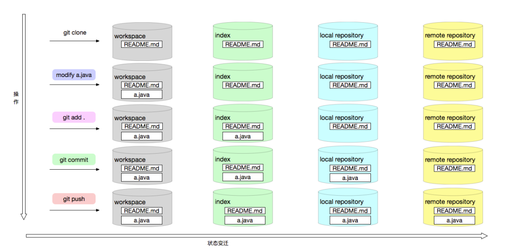
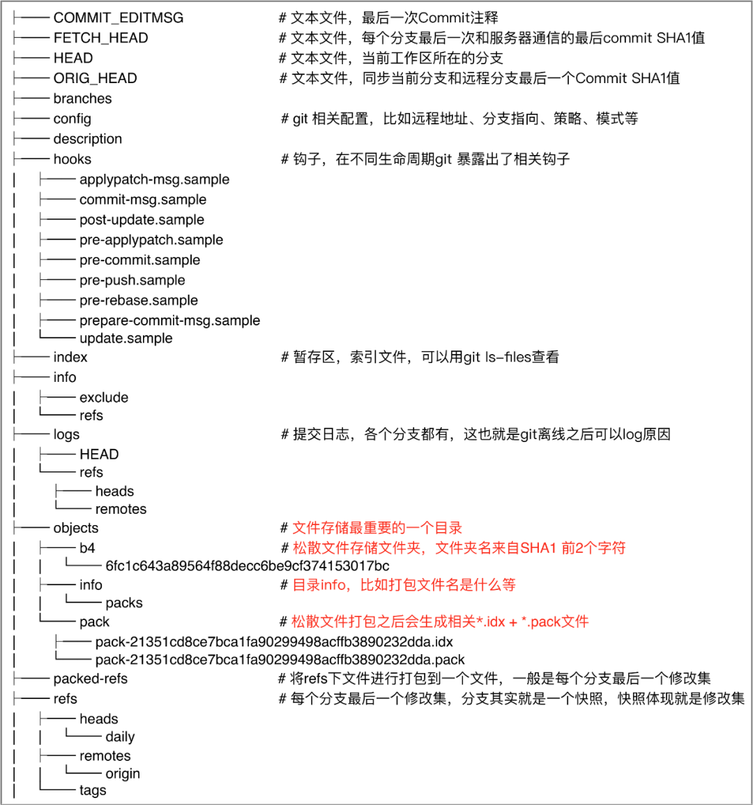
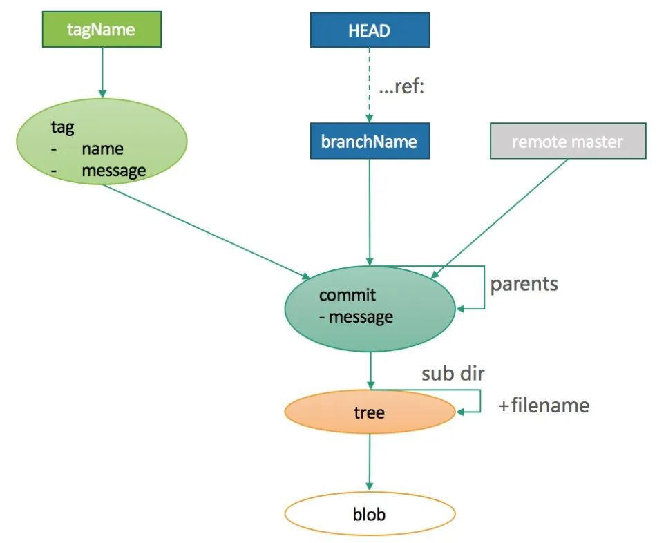
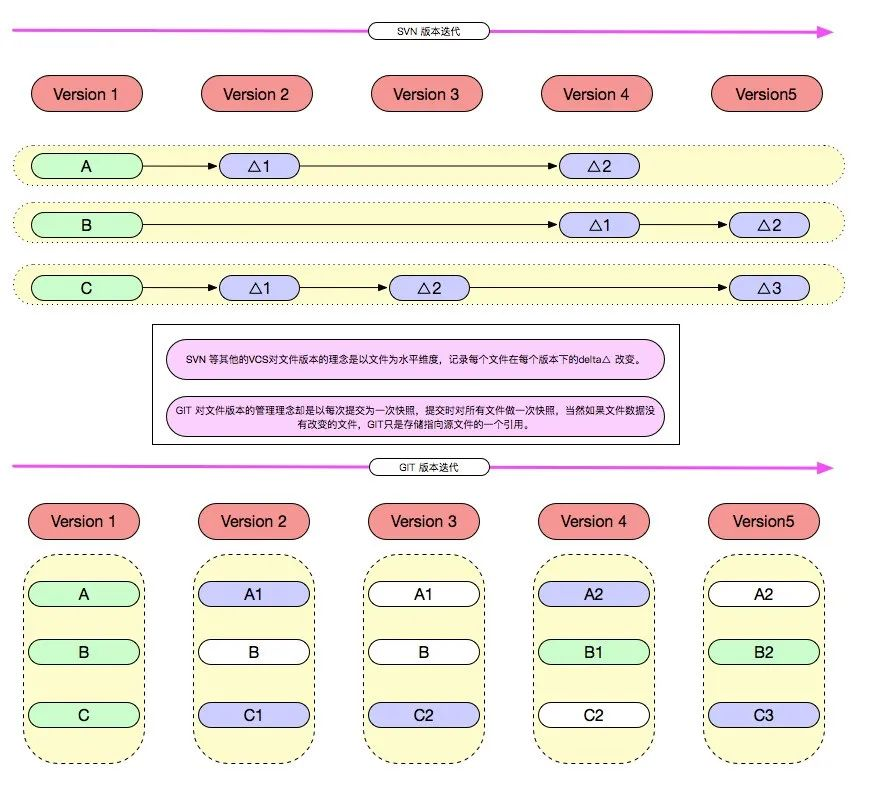

## 前言
git是一种源代码版本控制系统，因此操作方便、性能高效，已经逐渐取代了svn成为了主流的版本控制系统。本文主要是分析一下git的底层原理和常用命令。
## 状态模型

上图展示了git对象在不同生命周期中的存储位置，通过git命令可以改变git对象的生命周期。上图展示的几个生命周期：
### 工作区（workspace）
即本地的代码区
### 暂存区（index）
本地文件通过add命令可以提交到暂存区，然后通过commit命令可以提交到本地仓库（local repository）。
### 本地仓库（local repository）
连接暂存区和远程仓库的重要部分，所有的离线操作均可以通过和本地仓库通信来进行，等需要的时候再和远程仓库交互。
### 远程仓库（remote repository）
中心化仓库，所有人共享，本地仓库会需要和远程仓库进行交互，也就能将其他所有人内容更新到本地仓库把自己内容上传分享给其他人。结构大体和本地仓库一样。

下面以一个例子来看下文件存储的分析。

上图展示了add、commit、push等操作下文件的存储位置变化。

## 对象模型

上图展示了git仓库的完整文件结构，
git中有四种对象，blob、tree、commit和tag，它们之间的关系如下：

### blob
存储单个文件的二进制内容，不包含任何其他文件信息，如文件名、其他元数据等
### tree
存储对应的文件系统的目录结构，如子目录（tree）、文件列表、文件类型、文件权限等。
### commit对象
是一次修改的集合，是修改过的所有文件集合的一次快照。
### tag
关联当前版本库的最后一次commit对象。

## 存储模型
Svn 等其他的 VCS 对文件版本的理念是以文件为水平维度，记录每个文件在每个版本下的 delta 改变。

Git 对文件版本的管理理念却是以每次提交为一次快照，提交时对所有文件做一次全量快照，然后存储快照引用。

这就是git区别于svn的最主要原因之一。

## 常用命令

## 参考
- https://mp.weixin.qq.com/s/p-BKKYg-aIu1eYFxBCb5eg